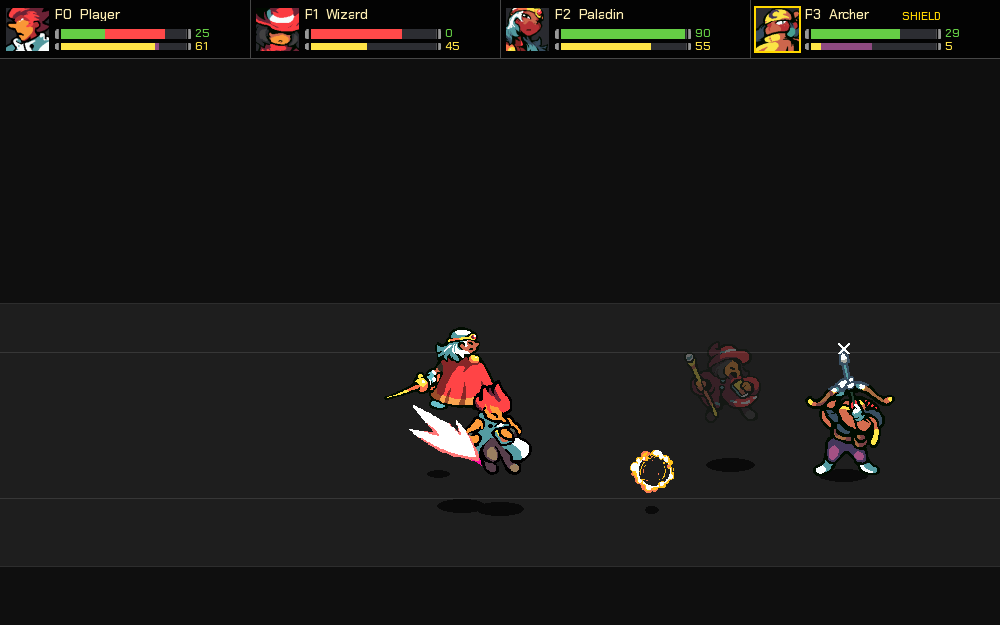

[](https://github.com/RemiErr/BattleLite)
[](https://github.com/RemiErr/BattleLite)
[](https://github.com/RemiErr/BattleLite/releases/latest)

---

# BattleLite 



BattleLite 是一款 2D 橫向捲軸多人對戰遊戲，最多支援 4 人透過 P2P 連線對戰，延遲對策採用 GGRS (Rollback Netcode) 回滾機制。專案架構採用混合方案，由 Python 負責畫面算繪、資源調度與信令流程，Rust 負責處理戰鬥時的操作運算與 GGRS Session，兩者之間是透過 PyO3 暴露為 `battlelite_core` 模組進行整合。

---

## 目錄

- [BattleLite](#battlelite)
  - [目錄](#目錄)
  - [一、 架構總覽](#一-架構總覽)
    - [模組分工](#模組分工)
    - [Tech Stack](#tech-stack)
    - [遊戲流程](#遊戲流程)
  - [二、 2.5D 物理系統](#二-25d-物理系統)
  - [三、 固定點算術與確定性](#三-固定點算術與確定性)
  - [四、 角色狀態機](#四-角色狀態機)
  - [五、 碰撞系統](#五-碰撞系統)
    - [判定框種類](#判定框種類)
    - [3D AABB 碰撞公式（Rust 實作）](#3d-aabb-碰撞公式rust-實作)
    - [近戰命中觸發時間窗](#近戰命中觸發時間窗)
  - [六、 投射物（Entity）系統](#六-投射物entity系統)
    - [Entity 資料結構](#entity-資料結構)
    - [投射物生命週期](#投射物生命週期)
    - [投射物碰撞判定](#投射物碰撞判定)
    - [近戰 vs 投射物控制旗標](#近戰-vs-投射物控制旗標)
  - [七、 網路架構](#七-網路架構)
    - [整體連線流程](#整體連線流程)
    - [Lobby Server（Signaling Server）](#lobby-serversignaling-server)
    - [排行榜與牌位統計](#排行榜與牌位統計)
  - [八、 STUN 探測與 NAT 打洞](#八-stun-探測與-nat-打洞)
    - [為什麼需要 STUN？](#為什麼需要-stun)
    - [STUN 探測實作](#stun-探測實作)
    - [NAT 打洞（UDP Hole Punching）](#nat-打洞udp-hole-punching)
    - [端點選擇策略](#端點選擇策略)
  - [九、 GGRS 回滾機制](#九-ggrs-回滾機制)
    - [什麼是 Rollback Netcode？](#什麼是-rollback-netcode)
    - [GGRS 在 BattleLite 的實作](#ggrs-在-battlelite-的實作)
    - [確定性要求](#確定性要求)
    - [輸入延遲（Input Delay）](#輸入延遲input-delay)
  - [十、 Session 啟動流程](#十-session-啟動流程)
    - [安全的 Session 資料傳遞](#安全的-session-資料傳遞)
  - [十一、 AI 對手系統](#十一-ai-對手系統)
    - [AI 層級設計](#ai-層級設計)
    - [LV1：FSM（有限狀態機）](#lv1fsm有限狀態機)
    - [LV2：Pattern AI（招式腳本）](#lv2pattern-ai招式腳本)
    - [LV3：GOAP + Fuzzy Logic](#lv3goap--fuzzy-logic)
    - [AI 穩定性優化](#ai-穩定性優化)
    - [Debug Overlay](#debug-overlay)
    - [模組結構](#模組結構)
    - [AI 在離線與連線模式的責任](#ai-在離線與連線模式的責任)
  - [十二、 打包與資源路徑](#十二-打包與資源路徑)
    - [PyInstaller 雙執行檔](#pyinstaller-雙執行檔)
    - [資源根目錄](#資源根目錄)
  - [十三、 快速啟動](#十三-快速啟動)
    - [環境安裝](#環境安裝)
    - [常用指令](#常用指令)
    - [遊戲內快捷鍵](#遊戲內快捷鍵)
  - [引用資源](#引用資源)

---

## 一、 架構總覽

```
┌─────────────────────────────────────────────────────────────────┐
│                        BattleLite 架構                          │
│                                                                 │
│  ┌──────────────────────────────────────────────────────────┐   │
│  │                      Python 應用層                        │   │
│  │                                                          │   │
│  │  launcher.py          main.py         lobby_server/      │   │
│  │  ┌──────────┐    ┌─────────────┐  ┌──────────────────┐   │   │
│  │  │ 配對大廳  │    │  遊戲主循環  │  │ Signaling Server │   │   │
│  │  │ (CTk)    │    │  (Pygame)   │  │     (FastAPI)    │   │   │
│  │  └────┬─────┘    └──────┬──────┘  └──────────────────┘   │   │
│  │       │ 加密 payload    │ 讀取/渲染狀態                   │   │
│  └───────┼─────────────────┼────────────────────────────────┘   │
│          │ CLI 參數        │ PyO3 綁定                          │
│  ┌───────▼─────────────────▼────────────────────────────────┐   │
│  │                       Rust 運算層                         │   │
│  │                                                          │   │
│  │    OfflineSession          GGRSSession                   │   │
│  │    ┌──────────────┐    ┌──────────────────┐              │   │
│  │    │  本機模擬     │    │  P2P 回滾同步    │              │   │
│  │    └──────┬───────┘    └────────┬─────────┘              │   │
│  │           └─────────┬───────────┘                        │   │
│  │                     │                                    │   │
│  │                perform_tick()                            │   │
│  │              ┌──────────────────┐                        │   │
│  │              │  物理 / 碰撞 /    │                        │   │
│  │              │  狀態機 / 實體    │                        │   │
│  │              └──────────────────┘                        │   │
│  └──────────────────────────────────────────────────────────┘   │
└─────────────────────────────────────────────────────────────────┘
```

**設計原則：**
- **Rust 主運算**：提供影響遊戲結果的邏輯運算（物理、碰撞、傷害），確保效率與穩定性。
- **Python 主互動**：Pygame 負責讀取 Rust 算好的座標並繪製 Sprite，不直接參與邏輯運算。
- **PyO3 橋接**：透過 `maturin` 將 Rust 編譯為 Python 擴充模組（`.so`），Python 以 `import battlelite_core` 呼叫。

### 模組分工

```
BattleLite/
├── src/python/
│   ├── launcher.py              # 遊戲啟動器 (CustomTkinter)
│   ├── main.py                  # 遊戲入口：解析 payload、建立 session
│   ├── app_root.py              # 定義資源根目錄
│   ├── session/
│   │   ├── adapter.py           # OfflineAdapter / GGRSAdapter
│   │   └── char_config.py       # 調度角色參數
│   ├── game/
│   │   ├── input_manager.py     # 按鍵常數、按鍵映射等
│   │   ├── match_manager.py     # 勝負判定、開場倒數等
│   │   └── loop.py              # 遊戲主迴圈、GUI 算繪
│   ├── lobby_server/main.py     # Signaling Server + 排行榜 API
│   ├── ai/                      # 三種 AI 演算法
│   ├── assets_manager/          # 角色 Sprite / PhysicsStats / AbilityDef
│   └── *_manager.py             # 算繪、特效、音效、Debug 管理器
├── src/rust_core/src/
│   ├── lib.rs                   # PyO3 模組入口、封包解密
│   ├── config.rs                # 綁定各種 Config
│   ├── player.rs                # 綁定遊戲角色參數
│   ├── entity.rs                # 綁定投射物
│   ├── physics.rs               # 負責物理 / 生命狀態相關運算
│   ├── game_state.rs            # 遊戲狀態、運算週期
│   ├── offline_session.rs       # OfflineSession
│   └── ggrs_session.rs          # GGRSSession
├── src/assets/                  # 遊戲素材
├── tests/
└── BattleLite.spec
```


**資料流：**

```
角色定義（Python）
  └─ PhysicsStats / AbilityDef / HitboxDef
       │
       ▼ apply_char_config()
Rust CharConfig / AbilityConfig
       │
       ▼ perform_tick(inputs)
GameState / Player / Entity
       │
       ▼ Python 讀取狀態
Pygame Renderer / HUD / FX / SFX
```

### Tech Stack

| 類別         | 技術                       | 用途                                     |
| ------------ | -------------------------- | ---------------------------------------- |
| 遊戲畫面     | Pygame                     | 視窗、輸入、Sprite、音效與主循環         |
| Launcher UI  | CustomTkinter              | 主選單、設定、房間、離線 AI 面板、排行榜 |
| 戰鬥核心     | Rust + PyO3                | Python 可呼叫的 `battlelite_core` 擴充   |
| Rollback     | GGRS                       | P2P input synchronization + rollback     |
| 信令伺服器   | FastAPI + WebSocket        | 房間狀態、端點交換、game_start 廣播      |
| 排行榜資料庫 | SQLite + aiosqlite         | `matches` / `match_results` 牌位賽統計   |
| 安全傳遞     | ChaCha20-Poly1305 + Base64 | Launcher → Game 的 session payload 加密  |
| 網路探測     | STUN + UDP Hole Punching   | NAT 後方玩家建立 P2P UDP 通道            |
| 設定管理     | JSON + python-dotenv       | `settings.json`、Lobby URL、執行環境切換 |
| 打包         | PyInstaller                | `BattleLite` + `Game` 雙執行檔           |


### 遊戲流程

遊戲內目前有三種建立戰鬥的方式：

```
離線模式
  Launcher 離線設定 / 直接 main.py
      │
      ▼
  OfflineSession
      │
      ├─ 本地玩家
      └─ 本地 AI（FSM / Pattern / GOAP）

自訂房間
  開房 / 加入房碼
      │
      ▼
  Lobby Server 交換端點與選角
      │
      ▼
  GGRSSession P2P
      │
      └─ 對戰結果會送到 /submit_result，但 server 回 ranked=false，不列入排行榜

牌位賽（排隊 / 天梯）
  查詢玩家當前牌位，匹配同牌位對手  (2 min limit)
      │
      ▼
  __queue_{tier}__ → __queue_all__  (1 min limit)
      │
      ▼
  GGRSSession P2P
      │
      └─ room_code 符合 __queue_xxx__，結果寫入 leaderboard DB
```

Launcher 呼叫 Game 流程：

```
BattleLite Launcher
  │
  │ encrypt_payload(session_data)
  ▼
Game executable / main.py
  │
  │ decrypt_payload()
  ▼
OfflineSession 或 GGRSSession
```

---

## 二、 2.5D 物理系統

BattleLite 採用 LF2 風格的 2.5D 座標系：

```
         Z（高度 / 跳躍）
         │
         │          ● 玩家
         │         /│
         │        / │
         │       /  │ z（離地高度）
         │      /   │
 ────────┼─────/────┼──────────────── 地面 (z=0)
        /│    /     │
       / │   x──────┘
      /  │  （左右）
     /   │
    Y（深度 / 前後）

  螢幕投影:
  screen_x = world_x / 1000
  screen_y = world_y / 1000 - world_z / 1000   ← Z 軸在畫面上表現為垂直偏移
```

| 軸  | 方向     | 影響                              |
| --- | -------- | --------------------------------- |
| X   | 左右移動 | 角色橫向位置                      |
| Y   | 前後深度 | 決定繪製遮擋順序（Y 大 = 在前面） |
| Z   | 高低跳躍 | 受重力下拉；Z=0 為地面            |

**重力實作（Rust）：**
```
每幀: vz -= GRAVITY (400)
每幀: z  += vz
落地: if z <= 0 → z = 0, vz = 0
HURT 狀態落地時: vx /= 2（摩擦力）
```

**跳躍：**
```
按 JUMP 且 z == 0 → vz = JUMP_IMPULSE (9000)
跳躍高度 ≈ (9000)² / (2 × 400) = 101.25 單位（×1000 scale 後 ≈ 101 px）
```

---

## 三、 固定點算術與確定性

P2P 回滾的核心要求：**兩台機器跑同樣 inputs，必須得到完全相同的結果。**
浮點數（`f32`/`f64`）在不同 CPU/OS 上會有微小誤差，導致同步失敗（Desync）。

**解決方案：所有數值放大 1000 倍，以 `i32` 整數運算。**

```
現實單位      內部單位（×1000）   範例
─────────────────────────────────────────────────────
 1.5 px    →    1500            WALK_SPEED_X = 5000  (= 5 px/frame)
 9.0 px/f  →    9000            JUMP_IMPULSE = 9000  (= 9 px/frame)
 0.4 px/f² →     400            GRAVITY      = 400   (= 0.4 px/frame²)
```

**規則（不可違反）：**
- Rust 核心（所有模組）內嚴禁 `f32`/`f64`。
- Python 只在渲染時做 `/ 1000` 轉換，不回寫 Rust。
- 隨機數只能用 session 初始化時提供的 seed，不能用 `std::rand`。

---

## 四、 角色狀態機

```
              ┌──────────────────────────────────────────┐
              │                                          │
              ▼                                          │
   ┌──────────────────┐   移動鍵     ┌──────────────────┐ │
   │                  │ ──────────▶ │                  │ │
   │       IDLE       │              │      WALK       │ │
   │       (0)        │ ◀────────── │       (1)        │ │
   └────────┬─────────┘   無移動     └────────┬─────────┘ │
            │                               │            │
      ATTACK鍵                        ATTACK鍵           │
            │                               │            │
            ▼                               ▼            │
   ┌──────────────────┐           ┌──────────────────┐   │
   │      ATTACK      │           │      ATTACK      │   │
   │       (2)        │           │       (2)        │   │
   │  timer倒數完畢    │           │  timer倒數完畢   │   │
   └────────┬─────────┘           └────────┬─────────┘   │
            │ timer==0                     │ timer==0    │
            └──────────────┬───────────────┘             │
                           │ → IDLE                      │
                           │                             │
   SKILL鍵（有足夠MP）      │       被攻擊命中             │
            │              │            │                │
            ▼              │            ▼                │
   ┌──────────────────┐    │   ┌──────────────────┐      │
   │      SKILL       │    │   │       HURT       │      │
   │       (4)        │    │   │       (3)        │      │
   │  timer倒數完畢    │    │   │  timer倒數完畢   │      │
   └────────┬─────────┘    │   └────────┬─────────┘      │
            │ timer==0     │            │ timer==0       │
            └──────────────┘            └────────────────┘
```

**狀態轉換規則：**
- `ATTACK` / `SKILL` 期間忽略移動輸入（`vx=0, vy=0`）。
- `HURT` 期間忽略所有輸入，僅受物理（重力、慣性衰減）影響。
- 命中後觸發 **Hitstop**（4幀），攻擊者與受擊者同時停頓，強化打擊感。

---

## 五、 碰撞系統

### 判定框種類

```
            角色 Sprite
   ┌────────────────────────────┐
   │    ┌──────────────────┐    │
   │    │                  │    │  ← HURT BOX（綠）
   │    │     HURT BOX     │    │    身體碰撞範圍，被攻擊時觸發
   │    │                  │    │
   │    └──────────────────┘    │
   │                            │  ┌──────┐
   │                            │  │ HIT  │  ← HIT BOX（紅）
   │                            │  │ BOX  │    攻擊動作觸發
   │                            │  └──────┘
   └────────────────────────────┘
           角色中心 (0,0)
     ←── ox 負值  │  ox 正值 ──→
                  ↓ oy 正值
```

### 3D AABB 碰撞公式（Rust 實作）

```
攻擊方中心 = attacker.x + (facing_right ? +front : -front)
受害方中心 = victim.x   + (facing_right ? +hurt_front : -hurt_front)

命中條件:
  |atk_center_x - vic_center_x| < atk_half_w + hurt_half_w   (X 軸)
  |attacker.y   - victim.y    | < atk_depth                  (Y 軸深度)
  |atk_center_z - vic_center_z| < atk_half_h + hurt_half_h   (Z 軸高度)
```

### 近戰命中觸發時間窗

```
timer 值:  atk_timer → ... → 15 → 14 → ... → 5 → 4 → ... → 0
                               ╔══════════════╗
                               ║  命中判定窗   ║  (timer: 15 → 5)
                               ╚══════════════╝
```

---

## 六、 投射物（Entity）系統

### Entity 資料結構

```
Entity {
  owner_id        : usize  // 發射者 player index
  character_type  : usize  // 發射者角色類型（查詢 AbilityConfig 碰撞尺寸用）
  ability_state_id: u32    // 對應哪個 ability（決定 hitbox 尺寸與傷害來源）
  x, y, z         : i32    // 當前位置
  vx, vy          : i32    // 速度（每幀位移）
  lifetime        : u32    // 剩餘存活幀數（降到 0 自動消失）
  is_skill        : bool   // true=SKILL投射物, false=ATTACK投射物（視覺用）
}
```

### 投射物生命週期

```
SKILL 動作開始
  │
  │  timer = skl_timer (例: 96)
  │
  ▼  每幀 timer--
  .
  .  timer == spawn_timer (例: 36)
  │  ─────────────────────────────────▶ 產生 Entity
  .                                         │
  .                                         │ 每幀: x += vx
  .                                         │       lifetime--
  ▼  timer == 0 → 狀態回 IDLE                │
                                            ▼  lifetime == 0
                                          Entity 消失

距離衰減傷害:
  ratio  = entity.lifetime / total_lifetime   (0.0~1.0)
  damage = base_dmg × ratio
  ↑ 投射物剛發射時傷害最高，飛愈遠傷害愈低
```

### 投射物碰撞判定

```
投射物使用與近戰相同的 AABB 判定，
尺寸來源:
  is_skill=true  → skl_half_w / skl_depth / skl_half_h
  is_skill=false → atk_half_w / atk_depth / atk_half_h

視覺（Python）: FxDef 定義的 sprite sheet，動畫循環播放
               跟隨 Entity.x/y/z 位置渲染
```

### 近戰 vs 投射物控制旗標

| 旗標                  | 效果                                         |
| --------------------- | -------------------------------------------- |
| `atk_melee_enabled`   | True → ATTACK 狀態啟用近戰 hit_box 判定      |
| `skl_melee_enabled`   | True → SKILL 狀態啟用近戰 hit_box 判定       |
| `atk_projectile_vx≠0` | ATTACK 動作在 `atk_spawn_timer` 幀發射投射物 |
| `projectile_vx≠0`     | SKILL 動作在 `spawn_timer` 幀發射投射物      |

兩者完全獨立，可同時開啟（近戰＋遠程）或各自關閉。

---

## 七、 網路架構

### 整體連線流程

```
玩家 A                        Lobby Server                   玩家 B
   │                               │                            │
   │── WS 連線 /ws/{room}/{name} ─▶│                            │
   │                               │◀─── WS 連線 ───────────────│
   │                               │                            │
   │◀── room_update ──────────────│── room_update ────────────▶│
   │                               │                            │
   │── report_endpoint ──────────▶│◀── report_endpoint ────────│
   │   { pub_ip, pub_port,         │    { pub_ip, pub_port,     │
   │     local_ip, local_port }    │      local_ip, local_port} │
   │                               │                            │
   │                               │    (所有玩家皆回報完畢)      │
   │                               │                            │
   │◀── punch_start ──────────────│── punch_start ────────────▶│
   │    { seed, players[] }        │   { seed, players[] }      │
   │                               │                            │
   │  [互相發送 UDP 打洞封包]       │                            │
   │ ────────────────────────────────────────────────────────▶ │
   │ ◀──────────────────────────────────────────────────────── │
   │                              │                             │
   │                         (等待 2 秒)                         │
   │                              │                             │
   │◀── game_start ───────────────│── game_start ─────────────▶│
   │    { seed, players[] }       │    { seed, players[] }      │
   │                              │                             │
   │  [啟動 GGRSSession P2P]       │     [啟動 GGRSSession P2P]  │
   │ ◀════════════ GGRS UDP 封包（只傳 Input） ═════════════════ │
```

### Lobby Server（Signaling Server）

- **技術**：FastAPI + WebSocket + SQLite (`aiosqlite`)
- **職責**：收集玩家的公網端點，協調打洞時序，廣播 `game_start`
- **不傳遞**：遊戲狀態、位置座標
- **部署**：Docker 容器，URL 由 `.env` 中 `LOBBY_SERVER_URL_LOCAL` / `LOBBY_SERVER_URL_CLOUD` 與 `LOBBY_USE_LOCAL` 切換

```
WebSocket 訊息類型:
  room_update     → 房間玩家列表更新
  report_endpoint → 玩家上報自己的 pub/lan IP:Port
  punch_start     → 觸發打洞，攜帶 seed 和所有玩家端點
  game_start      → 打洞等待後，通知正式開始（2 秒延遲）
```

### 排行榜與牌位統計

排行榜只統計「牌位賽」結果。自訂房間與離線模式不影響段位。

```
房間類型:
  自訂房間    → ABC123 / 玩家輸入房碼
  牌位賽房間  → __queue_{tier}__ / __queue_all__

戰果提交:
  main.py → POST /submit_result
       │
       ├─ room_code 不符合 __queue_xxx__ → ranked=false，不寫入 DB
       └─ room_code 符合 __queue_xxx__   → ranked=true，寫入 DB
```

Database Schema：

| Table         | Content                                  |
| ------------- | ---------------------------------------- |
| matches       | `match_id`、`room_code`、開始時間        |
| match_results | 玩家暱稱、角色、勝 / 負 / 平手、提交時間 |

> 查詢端也會再次過濾 `matches.room_code`：

```
/leaderboard
  → 只統計 room_code LIKE "__queue_%__" 的 match_results

/player_tier/{nickname}
  → 只用牌位賽結果計算 games / win_rate / tier
```

> 即使舊資料曾混入自訂房間的戰鬥結果，也不會顯示在排行榜。

---

## 八、 STUN 探測與 NAT 打洞

### 為什麼需要 STUN？

```
玩家 A 的視角:                    玩家 B 的視角:
  LAN IP: 192.168.1.10              LAN IP: 192.168.1.20
  LAN Port: 5000                    LAN Port: 5001

              ┌─────────────────────────────┐
              │           Router            │
              │  A ─▶ NAT ─▶ 1.2.3.4:10001 │
              │  B ─▶ NAT ─▶ 5.6.7.8:20002 │
              └─────────────────────────────┘

A 不知道自己對外的 IP:Port 是什麼 → 需要 STUN 探測
```

### STUN 探測實作

```python
# stun_utils.py 核心邏輯

# 1. 在指定 port 綁定 UDP socket
sock.bind(('0.0.0.0', local_port))

# 2. 發送 STUN Binding Request（RFC 5389）
#    封包格式: [Type(2B)] [Length(2B)] [Magic(4B)] [TransactionID(12B)]
request = struct.pack("!HHI12s", 0x0001, 0, 0x2112A442, transaction_id)
sock.sendto(request, ("stun.l.google.com", 19302))

# 3. 解析回應的 XOR-MAPPED-ADDRESS 屬性
#    port = x_port XOR (Magic >> 16)
#    ip   = x_ip   XOR Magic
public_ip, public_port = parse_response(data)
```

### NAT 打洞（UDP Hole Punching）

```
目標: 讓 A 和 B 能直接 P2P 通訊，繞過 NAT

步驟:
  1. 大廳交換端點後，A 和 B 同時向對方的公網端點發送 UDP 封包
  2. 發送封包的動作會在各自的 NAT 上「打開一個洞」
  3. 對方的封包抵達時，NAT 認為這是已知連線，允許通過

     A (1.2.3.4:10001)                B (5.6.7.8:20002)
          │                                  │
          │── UDP → 5.6.7.8:20002 ─────────▶│  A 的 NAT 記錄此連線
          │                                  │
          │◀──────── UDP ← 5.6.7.8:20002 ───│  B 的封包通過 A 的 NAT
          │                                  │
          │  P2P 通道建立！                   │

```
> 問題： 時序敏感，兩端必須「幾乎同時」發送
> 解法： Lobby 的 `punch_start` 訊息作為同步信號，固定等待 2 秒後才發 `game_start`

### 端點選擇策略

同網域優先選擇，若玩家處於不同網路端點才走打洞路線

```
Launcher 上報兩個端點:
  pub_ip / pub_port       ← STUN 探測到的公網端點
  local_ip / local_port   ← 本機 LAN IP（路由探測）

連線建立邏輯:
  if A.pub_ip == B.pub_ip:
      # 同一個 NAT 後面（同網域）→ 使用 LAN IP
      connect(B.local_ip, B.local_port)
  else:
      # 不同網域 → 使用公網端點（打洞）
      connect(B.pub_ip, B.pub_port)
```

> 本專案未實作 TURN

---

## 九、 GGRS 回滾機制

### 什麼是 Rollback Netcode？

```
傳統「延遲式」網路代碼:
  等對方輸入到了才處理 → 畫面停頓（Lag）

回滾式網路代碼（GGRS）:
  用「預測」填補網路延遲，等真實輸入到了再「回滾重算」

  Frame 60: B 的 input 未到 → 預測 B 還在走路
  Frame 62: B 的 input 到了 → 發現 B 其實跳躍了！
              → 回滾到 Frame 60，用真實 input 重新計算 60/61/62
              → 畫面快速追上，幾乎無感
```

### GGRS 在 BattleLite 的實作

[GGRS](https://github.com/gschup/ggrs)：全稱 Good Game Rollback System，是在 Rust 上實作 [GGPO](https://www.ggpo.net) (Good Game Peace Out) 的一種 P2P 連線方式。

```
GGRSSession::advance() 每幀呼叫流程:

  session.poll_remote_clients()     ← 接收遠端封包
  session.add_local_input(input)    ← 提交本地輸入
  session.advance_frame()           ← GGRS 決定要做什麼

  回傳 GgrsRequest:
  ┌─────────────────────────────────────────────────────┐
  │ AdvanceFrame { inputs }                             │
  │   → perform_tick(state, inputs, configs)            │
  │   → 正常推進一幀                                     │
  ├─────────────────────────────────────────────────────┤
  │ SaveGameState { cell, frame }                       │
  │   → cell.save(frame, state.clone())                 │
  │   → 快照當前狀態（回滾的「存檔點」）                     │
  ├─────────────────────────────────────────────────────┤
  │ LoadGameState { cell }                              │
  │   → state = cell.load()                             │
  │   → 恢復快照（回滾的「讀檔」）                          │
  └─────────────────────────────────────────────────────┘
```

### 確定性要求

```
SaveGameState → LoadGameState → N × AdvanceFrame
  必須與不做回滾直接推進 N 幀得到完全相同的 GameState

這要求 perform_tick() 必須:
  >  只依賴 GameState（不讀取外部狀態）
  >  只用整數運算（固定點計算）
  >  不使用 std::rand（用 seed 初始化的 PRNG）
  >  不依賴時間（wall clock）
```

### 輸入延遲（Input Delay）

```
GGRS 預設加入 2 幀人工輸入延遲:
  Frame 1: 你按了跳躍
  Frame 3: 你看到角色跳起來（延遲 2 幀）

好處: 減少需要回滾的頻率
代價: 操作有 ~33ms 的輕微延遲感

設定位置: SessionBuilder::with_input_delay(2)
```

---

## 十、 Session 啟動流程

### 安全的 Session 資料傳遞

由於 Launcher 需要把 IP、Port、Seed 等資訊傳給 `main.py`，但透過 CLI 參數傳遞明文資料並不安全，因此在傳遞前先透過 [ChaCha20-Poly1305](https://en.wikipedia.org/wiki/ChaCha20-Poly1305) 演算法加密。

```
 Launcher                             main.py
    │                                    │
    │  payload = {                       │
    │    "local_id": 0,                  │
    │    "players": [                    │
    │      {"ip": "1.2.3.4",             │
    │       "port": 10001, "id": 1}      │
    │    ],                              │
    │    "seed": 123456                  │
    │  }                                 │
    │                                    │
    │  nonce = os.urandom(12)            │
    │  ciphertext = ChaCha20(payload)    │
    │  encoded = base64(nonce + cipher)  │
    │                                    │
    │── python main.py --payload <B64>─▶│
    │                                    │
    │                decrypt_payload()   │
    │                → 取得 ip/port/seed │
    │                → 建立 GGRSSession  │
```

> **格式：** `Base64(Nonce[12 bytes] + Ciphertext)`

---

## 十一、 AI 對手系統

**BattleLite 的 AI 不直接改寫 Rust state**，而是和人類玩家一樣每幀產生 1-byte input bitmask。這讓 AI 可以共用同一套 `perform_tick()`，也讓線上 AI 能透過 GGRS 以「輸入」同步。

```
AIController.decide(ai_p, opp_p, entities)
        │
        ▼
input mask (1 byte)
        │
        ▼
OfflineSession.advance() / GGRSSession.add_local_input()
        │
        ▼
Rust perform_tick()
```

### AI 層級設計

AI 採用層級化架構，三個等級分別為：

| 等級 | 控制器                | 技術核心                                |
| ---- | --------------------- | --------------------------------------- |
| LV1  | `FSMAIController`     | 有限狀態機 + 反應延遲（reaction_delay） |
| LV2  | `PatternAIController` | 謂詞觸發的招式腳本序列                  |
| LV3  | `GOAPAIController`    | A* 行動規劃 + 模糊邏輯動態成本          |

> **謂詞（Predicate）：**  
> 在 Pattern AI 中表示一個條件判斷函數，輸入當前遊戲狀態，回傳 True 或 False。  
> Aka => 用函數將邏輯判斷打包成具有語意的人話。

範例：
```python
# ai/predicates.py 裡的謂詞長這樣：
def dist_close(ws):     return ws.dist_x < 120_000
def y_aligned(ws):      return ws.dist_y < 20_000
def can_use_skill(ws):  return ws.self_mp >= ws.skill_cost
def self_hp_low(ws):    return ws.self_hp < ws.max_hp * 0.3

# 一張 Mage 的 Pattern 卡可能長這樣：
Pattern(
    name="close_skill",
    predicates=[dist_close, y_aligned, can_use_skill],  # ← 三個謂詞
    action_sequence=[SKILL, TOWARD, TOWARD, ...]
)

# 只有在「距離近 且 Y 軸對齊 且 MP 足夠」成立，
# Mage AI 才會鎖定這張卡並開始播放技能序列。
```


**Fallback 鏈（確保任何情況下都有輸出）：**

```
make_ai(char_type, level, seed)
  │
  ├─ level=1 → FSM
  ├─ level=2 → Pattern ──fallback──▶ FSM
  └─ level=3 → GOAP ──fallback──▶ Pattern ──fallback──▶ FSM
```

---

### LV1：FSM（有限狀態機）

5 個離散狀態，每幀根據環境數值決定轉移：

```
APPROACH ──(在攻擊範圍內)──▶ ATTACK
ATTACK   ──(攻擊完成)──────▶ RETREAT
RETREAT  ──(安全距離)──────▶ APPROACH
APPROACH ──(MP 足夠)───────▶ SKILL
任意狀態  ──(隨機)──────────▶ WAIT
```

- **`reaction_delay`**：AI 不會立即反應，環境改變後須等待數幀才切換狀態，**模擬人類反應時間**。
- **`FSMDifficultyParams`**：難度參數控制反應延遲長短與攻擊頻率。

---

### LV2：Pattern AI（招式腳本）

基於「謂詞（Predicate）+ 行動序列（action_sequence）」驅動：

1. 每幀評估所有 Pattern 的觸發謂詞（如 `dist_close AND y_aligned AND can_use_skill`）
2. 謂詞滿足 → 鎖定對應 Pattern，逐幀播放預設按鍵序列
3. 序列執行完畢或謂詞不再成立 → 解鎖，重新選擇

**符號化方向解析**：Pattern 支援 `TOWARD`（朝向對手）與 `AWAY`（遠離對手）符號，執行時動態轉換為實際左右鍵，避免 AI 站在不同側時方向指令出錯。

每個角色有獨立的 Pattern 表（`ai/characters/`），反映各角色的技能特性。

---

### LV3：GOAP + Fuzzy Logic
（目標導向行動規劃 + 模糊邏輯）

由兩層組成：

**感官層（Fuzzy Logic）**

將精確數值轉換為模糊集合隸屬度，賦予 AI「程度感」：

```
HP: 40%  →  { lo: 0.2, md: 0.7, hi: 0.1 }
MP: 80%  →  { lo: 0.0, md: 0.3, hi: 0.7 }
Dist: 遠  →  { close: 0.1, mid: 0.4, far: 0.5 }
```

> tip:  
> 這邊模糊化是透過 `evaluate()` 進行向量正規化，最終會取出一組總和為 1 的浮點數結果。 
>  
> ㄜ... 用人話說就是：  
> 「當前血量狀態為 _____ 狀態」，將 100% 可能性分成：
> - 20% 可能為低
> - 70% 可能為中
> - 10% 可能為高
>
> 血量只會有**一種狀態**，只是它同時符合不同「可能性」的結果，因此總和必須為 1。

模糊向量決定目標選擇（7 個分支），依優先級高至低排序：

| 優先級 | 模式           | 觸發條件                         | 目標    | 行為語意     |
| ------ | -------------- | -------------------------------- | ------- | ------------ |
| 最高   | `gamble`       | 自身 HP 低 且 對手 HP 亦低       | WIN     | 孤注一擲     |
| 次高   | `conservative` | 自身 HP 低（對手不論）           | SURVIVE | 逃跑保命     |
| 中 ①   | `aggressive`   | 自身 HP 中段 且 對手血量少於自身 | WIN     | 把握機會進攻 |
| 中 ②   | `conservative` | 自身 HP 中段 且 平手或劣勢       | SURVIVE | 撤退迂迴     |
| 低 ①   | `aggressive`   | 自身 HP 充足 且 對手血量少於自身 | WIN     | 激進追殺     |
| 低 ②   | `balanced`     | 自身 HP 充足 且 雙方血量相近     | WIN     | 攻防平衡     |
| 低 ③   | `conservative` | 自身 HP 充足 但 對手血量多於自身 | WIN     | 偏保守攻擊   |


> tip:  
> 實際上這邊的模糊邏輯只做到一半，因為決策目標的狀態是離散的（參考行為語意）與需要即時計算等原因的考量，因此採用最大隸屬度法（`dominant()`）直接跳過解模糊化用暴力取出最大值。標準做法可以再進一步做解模糊化（重心法 etc.），輸出一個連續變化的純量。


**規劃層（GOAP）**

1. 根據模糊目標建立 World State 目標
2. A\* 搜尋所有可用 Action，找出總 Cost 最低的行動序列
3. **動態成本**：Action 的 Cost 受 Fuzzy 影響——危險時「靠近」成本上升，「防禦」成本下降
4. A\* 找不到合法計畫 → fallback 至 Pattern AI

每個角色有獨立的 GOAP Action 表（`ai/characters/`），含各自的 `attack_range` 設定。

---

### AI 穩定性優化

實際測試中發現三類行為異常並已修復：

**1. 決策抖動（遲滯補償，Hysteresis）**

問題：AI 在攻擊範圍邊緣因位置微小跳動導致 `in_range` 每幀切換，引發無窮重新規劃，視覺上呈現左右擺動。

修復（`ai/goap/world_state.py`）：
```
進入 in_range：目標進入 90% 攻擊範圍才成立
離開 in_range：目標離開 110% 攻擊範圍才失效
```

**2. Y 軸揮空（對齊閾值強制化）**

問題：AI 的 `y_aligned` 判斷閾值（舊值 80,000）遠大於 Rust 碰撞深度（25,000），導致 AI「以為」打得到但物理未碰撞。

修復：
- `Y_ALIGN_THRESHOLD` 下調至 **20,000**（嚴於 Rust 核心的 25,000）
- FSM / Pattern / GOAP 三層攻擊動作均加入 `y_aligned` 先決條件
- 新增 `make_y_align()` 動作，供 GOAP 在攻擊前主動補正 Y 軸偏差

**3. 視覺震盪（Y 軸死區）**

問題：AI 橫移時因 `dy != 0` 即輸出上下鍵，在對齊目標線附近來回過衝，視覺上呈現抖動。

修復：三層 AI 均引入 **5,000 單位** Y 軸死區——只有 `dy > 5,000` 才輸出上下鍵。

---

### Debug Overlay

離線模式下按 F1 切換 Debug Overlay 顯示，各等級顯示不同資訊：

| 等級 | 顯示內容                                                    |
| ---- | ----------------------------------------------------------- |
| LV1  | FSM 當前狀態                                                |
| LV2  | 當前 Pattern 名稱 + 序列進度                                |
| LV3  | 目標（Goal）、當前規劃動作、模糊隸屬度（HP/MP/Dist 各集合） |

> 已整合 AI 資訊面板，若有 AI 對手，該面板會改成顯示 AI 的決策參數與資訊。

---

### 模組結構

```
src/python/ai/
├── factory.py            # make_ai(char_type, level, seed)
├── world_state.py        # build_fsm/pattern/goap_world_state；含遲滯補償
├── predicates.py         # can_use_skill / self_hp_low / opponent_approaching
├── controllers/
│   ├── base.py           # AIController ABC（含 get_debug_info 抽象方法）
│   ├── fsm_ai.py         # FSMAIController + FSMDifficultyParams
│   ├── pattern_ai.py     # PatternAIController + Pattern dataclass
│   └── goap_ai.py        # GOAPAIController
├── fuzzy/
│   ├── membership.py     # 隸屬度函數（trapezoid / triangle）
│   └── variable.py       # FuzzyVariable
├── goap/
│   ├── action.py         # GoapAction dataclass
│   ├── planner.py        # A* 規劃器
│   ├── world_state.py    # GoapWorldState
│   └── base_actions.py   # 共用動作（approach / attack / y_align / defend…）
└── characters/
    ├── profile.py        # CharAIProfile（attack_range 等角色專屬參數）
    ├── knight_ai.py
    ├── mage_ai.py
    ├── archer_ai.py
    ├── paladin_ai.py
    └── wizard_ai.py
```

### AI 在離線與連線模式的責任

```
離線模式:
  所有 AI 都在本機 game/loop.py 產生 input

自訂房間 / 牌位賽（線上）:
  host 負責產生所有 AI input → 透過 GGRS 同步給其他玩家
  非 host 把 AI player slot 視為遠端玩家，接收 host 送來的 input
```

> 這個設計避免「每台機器各自跑 AI」造成決策分歧。AI 輸入只由 host 產生一次，其他玩家透過 GGRS 同步接收，和真人輸入的同步路徑完全相同。

---

## 十二、 打包與資源路徑

### PyInstaller 雙執行檔

`BattleLite.spec` 會打包兩個執行檔：

| 執行檔       | 入口                     | 職責                       |
| ------------ | ------------------------ | -------------------------- |
| `BattleLite` | `src/python/launcher.py` | 啟動器、房間、設定、排行榜 |
| `Game`       | `src/python/main.py`     | Pygame 戰鬥畫面            |

```
pyinstaller BattleLite.spec
        │
        ▼
dist/BattleLite/
├── BattleLite(.exe)
├── Game(.exe)
└── src/assets/...
```

Launcher 在開發模式下以 Python 腳本啟動 Game：

```
python src/python/main.py --payload <B64>
```

在 frozen 模式下則呼叫同目錄的 `Game` 執行檔：

```
dist/BattleLite/BattleLite.exe
  └─ launches → dist/BattleLite/Game.exe --payload <B64>
```

### 資源根目錄

資源路徑由 `src/python/app_root.py` 統一處理：

```
開發模式:
  PROJECT_ROOT = BattleLite/

PyInstaller frozen 模式:
  PROJECT_ROOT = sys._MEIPASS
```

用途：

```
os.path.join(PROJECT_ROOT, "src", "assets", ...)
```

`main.py` 額外有一段啟動 bootstrap：

```
python src/python/main.py
  → sys.path 預設只有 src/python
  → 先補 BattleLite/ 到 sys.path
  → 才能使用 from src.python... 的 package import
```

設定檔路徑則與資源不同：

```
開發模式:
  BattleLite/settings.json

打包後:
  執行檔同目錄/settings.json
```

這讓使用者調整音量、按鍵方案、視窗位置時，不需要修改 PyInstaller bundle 內部資源。

---

## 十三、 快速啟動

### 環境安裝

（範例環境：Ubuntu）

```bash
# 1. 系統依賴
sudo apt update && sudo apt install build-essential python3-dev python3-venv

# 2. Rust 工具鏈
curl --proto '=https' --tlsv1.2 -sSf https://sh.rustup.rs | sh
source $HOME/.cargo/env

# 3. Python 虛擬環境
python3 -m venv venv --without-pip
source venv/bin/activate
curl https://bootstrap.pypa.io/get-pip.py | python3
pip install maturin pygame pytest httpx fastapi uvicorn customtkinter \
            cryptography websockets python-dotenv aiosqlite pyinstaller

# 4. 若你需要重新編譯 Rust 核心用於開發
cd src/rust_core && maturin develop && cd ../..
```

### 常用指令

```bash
# 單機開發模式（無網路）
python src/python/main.py --payload ""

# 啟動 Launcher UI（含配對大廳）
python src/python/launcher.py

# 啟動 Signaling Server（本機測試用）
uvicorn src.python.lobby_server.main:app --reload --port 8000

# 編譯 Rust 核心為 Python wheel 並安裝
cd src/rust_core && maturin build --release && cd ../..
pip install <PATH/TO/BATTLELITE_CORE.whl> --force-reinstall

# PyInstaller 打包 Launcher + Game
pyinstaller BattleLite.spec

# 執行所有測試
pytest tests/

# 執行單一測試檔
pytest tests/test_physics.py -v
```

### 遊戲內快捷鍵

| 按鍵            | 功能                                |
| --------------- | ----------------------------------- |
| ESC             | 離開遊戲                            |
| 上下左右 / WASD | 移動（依設定的按鍵組合）            |
| Z / J           | 攻擊（依設定的按鍵組合）            |
| X / K           | 技能（依設定的按鍵組合）            |
| Space           | 跳躍                                |
| F1              | 切換 Debug、AI 資訊面板（離線模式） |
| F2              | 切換受控角色（離線模式）            |
| F3              | 切換角色職業（離線模式）            |
| P               | 暫停 / 繼續（離線模式）             |
| R               | 重新開始回合（離線模式）            |

---

## 引用資源

- Superpowers Asset Packs
  - 來源：<https://github.com/sparklinlabs/superpowers-asset-packs>
  - 授權：Creative Commons Zero v1.0 Universal (CC0-1.0)
  - 說明：本專案使用其中部分美術素材作為遊戲資源，感謝 Sparklin Labs 與素材作者 Pixel-boy。

- Noto Sans TC
  - 來源：<https://fonts.google.com/noto/specimen/Noto+Sans+TC>
  - 授權：SIL Open Font License 1.1（詳見 `src/assets/fonts/OFL.txt`）
  - 版權：Copyright 2014-2021 Adobe
  - 說明：用於遊戲介面的繁體中文字型顯示。

- Chakra Petch
  - 來源：<https://fonts.google.com/specimen/Chakra+Petch>
  - 授權：SIL Open Font License 1.1（詳見 `src/assets/fonts/OFL.txt`）
  - 版權：Copyright 2014 Cadson Demak
  - 說明：用於 HUD 的英文字型顯示。
